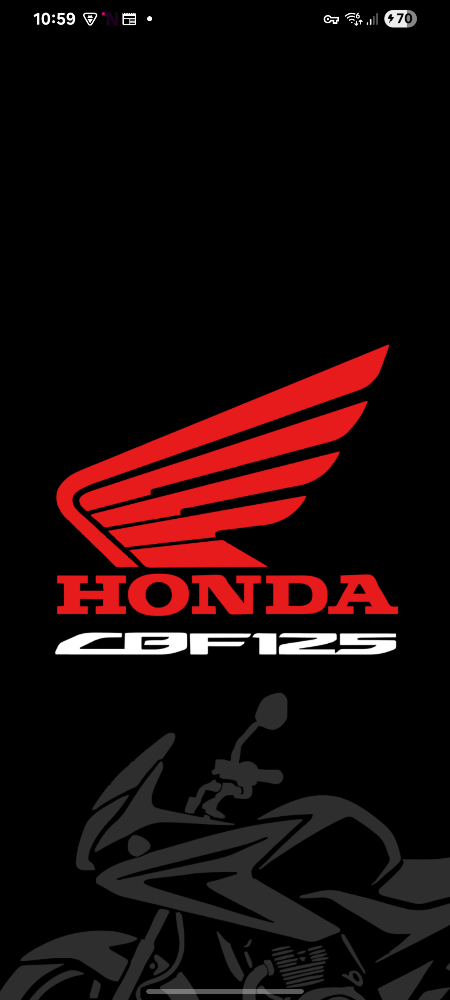
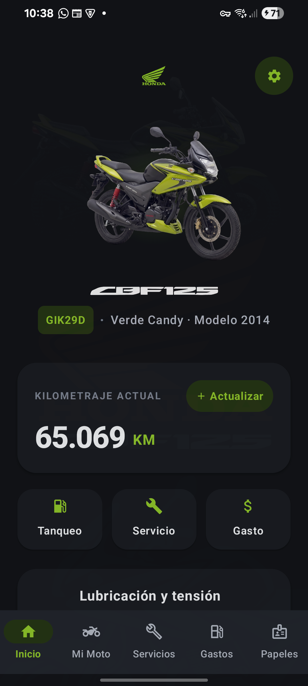
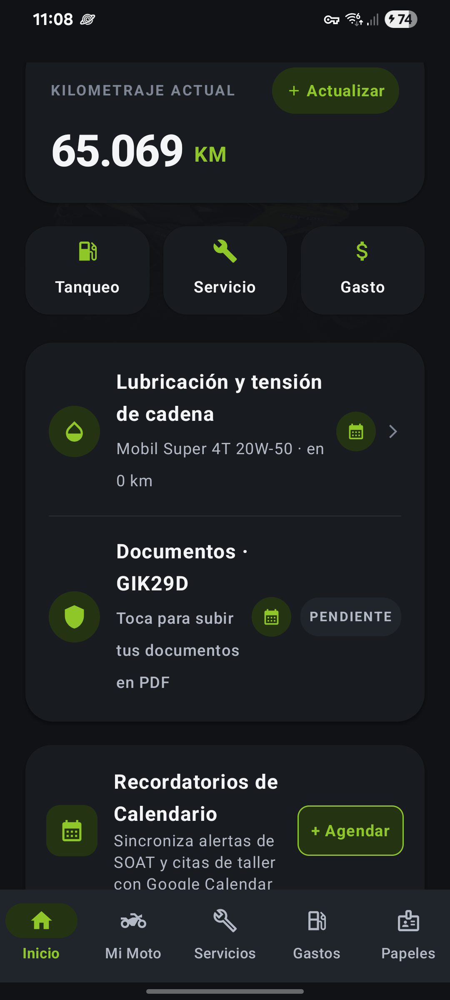
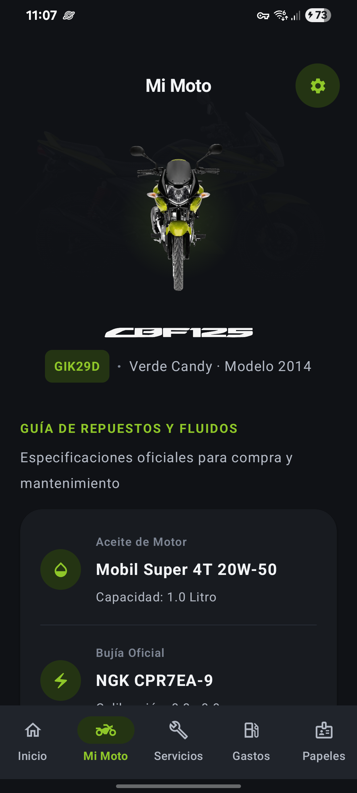
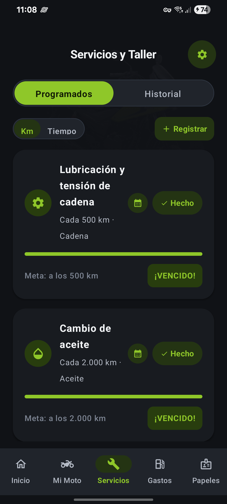
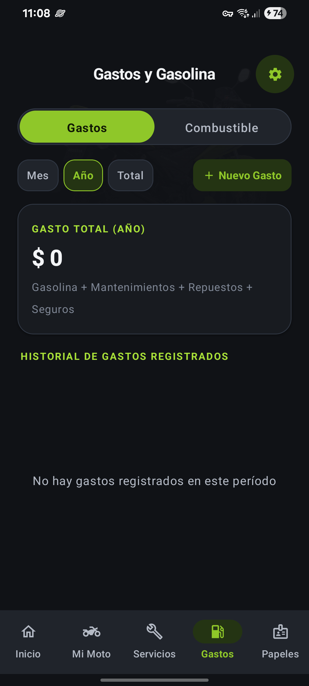
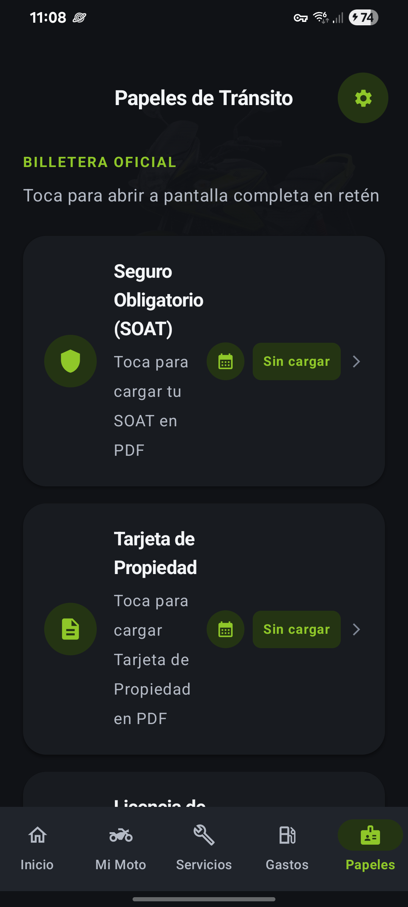

# 🏍️ Mi Honda CBF-125 · Control y Mantenimiento Inteligente

<p align="center">
  
</p>

<p align="center">
  <a href="https://github.com/sebastian09781/mi-honda-cbf125/releases/latest">
    
  </a>
  
  
  
</p>

Aplicación nativa para **Android** desarrollada con **Kotlin** y **Jetpack Compose**, diseñada especialmente para propietarios y entusiastas de la motocicleta **Honda CBF-125**.

Permite gestionar el odómetro en tiempo real, llevar un control riguroso de mantenimientos preventivos según el manual de taller de fábrica, guardar y consultar documentos de tránsito en PDF sin conexión a internet, registrar tanqueos y gastos con estaciones colombianas, y programar alertas sincronizadas directamente con **Google Calendar**.

---

## 📸 Capturas de Pantalla

| Inicio y Odómetro | Resumen y Calendario | Mi Moto & 3D Studio |
| :---: | :---: | :---: |
|  |  |  |

| Mantenimientos Programados | Gastos y Combustible | Billetera Digital Offline |
| :---: | :---: | :---: |
|  |  |  |

---

## ✨ Características Principales

### 1. 🛠️ Mantenimientos Preventivos Oficiales
* Basado al 100% en las especificaciones del **Manual de Taller Oficial de Honda**.
* Seguimiento en tiempo real por kilometraje y tiempo:
  * Cambio de aceite de motor (Mobil Super 4T 20W-50).
  * Limpieza, lubricación y ajuste de cadena (paso 428).
  * Limpieza y calibración de bujía (NGK CPR7EA-9 / 0.8 - 0.9 mm).
  * Calibración de holgura de válvulas (Admisión / Escape: 0.08 mm).
  * Cambio y limpieza de filtro de aire y centrífugo de aceite.
  * Inspección de zapatas y pastillas de freno.
* Cálculo automático de kilómetros restantes y estado visual con barras de progreso.

### 2. 📅 Integración con Google Calendar y Calendario del Dispositivo
* Agendado con **1 solo toque** para vencimientos de SOAT, Revisión Técnico-Mecánica, Impuesto Vehicular y citas de taller.
* Anticipación de alarmas configurable: el mismo día, 1 día antes, 3 días antes, 1 semana antes o 2 semanas antes.
* Integración nativa mediante `CalendarContract` sin solicitar permisos invasivos.

### 3. 📄 Billetera Digital Offline (Retenes y Tránsito)
* Almacena y visualiza en alta resolución copias en PDF de:
  * **SOAT** (Seguro Obligatorio de Accidentes de Tránsito).
  * **Tarjeta de Propiedad** (Licencia de Tránsito).
  * **Licencia de Conducción** (Pase A2).
  * **Cédula de Ciudadanía**.
* Visualizador de PDF integrado con zoom interactivo, búsqueda y modo pantalla completa sin consumir datos móviles.

### 4. 📖 Biblioteca de Manuales Técnicos Honda
* Acceso directo a los manuales oficiales de fábrica en PDF:
  1. Manual del Propietario CBF-125.
  2. Manual de Taller y Reparación CBF-125.
  3. Ficha Técnica y Especificaciones Oficiales.
  4. Tabla de Pares de Torsión y Aprietes de Chasis.
  5. Checklist de Inspección Periódica.

### 5. ⛽ Control de Combustible y Gastos
* Registro detallado de tanqueos: litros, costo total, odómetro y cálculo automático de rendimiento promedio (km/L).
* Selector de estaciones de servicio reconocidas en Colombia (Terpel, Primax, Mobil, Biomax, Texaco).
* Gráficos y desglose de gastos en repuestos, mantenimientos, accesorios y combustible.

### 6. 🚀 Asistente de Inicio (Onboarding)
* Flujo de bienvenida para configurar placa, color (chips interactivos), año y odómetro inicial.
* Opciones de exportación y restauración de copias de seguridad en formato JSON.

---

## 🛠️ Stack Tecnológico

* **Lenguaje:** Kotlin 2.0+
* **UI Framework:** Jetpack Compose (Material Design 3 con Dark Theme estilo *Editorial Studio*)
* **Persistencia de Datos:** Room Database (SQLite local cifrado y reactivo)
* **Arquitectura:** MVVM (Model-View-ViewModel) con Kotlin Coroutines y `StateFlow`
* **Visor de Documentos:** `PdfRenderer` nativo de Android
* **Integración del Sistema:** Android `CalendarContract`, Storage Access Framework (SAF) y FileProvider

## 📲 Descargar e Instalar

Puedes descargar directamente el instalador APK oficial desde la sección de lanzamientos:

👉 **[Descargar APK v1.0.0 (Releases)](https://github.com/sebastian09781/mi-honda-cbf125/releases/latest)**

---

## 🚀 Compilación Local

### Requisitos
* [Android Studio Hedgehog / Ladybug](https://developer.android.com/studio) o superior.
* JDK 17 o superior.
* Android SDK con `compileSdk = 35` o `34`.

### Pasos
1. Clona este repositorio:
   ```bash
   git clone https://github.com/sebastian09781/mi-honda-cbf125.git
   cd mi-honda-cbf125
   ```
2. Abre el proyecto en Android Studio o compila directamente desde la terminal:
   ```bash
   ./gradlew assembleDebug
   ```
3. Instala el archivo APK generado en tu teléfono o emulador:
   ```bash
   adb install app/build/outputs/apk/debug/app-debug.apk
   ```

---

## 📄 Licencia y Créditos

Desarrollado con dedicación y ❤️ desde Colombia en honor y tributo a la **Honda CBF-125**, la compañera fiel que abrió el camino a la pasión por las dos ruedas.
